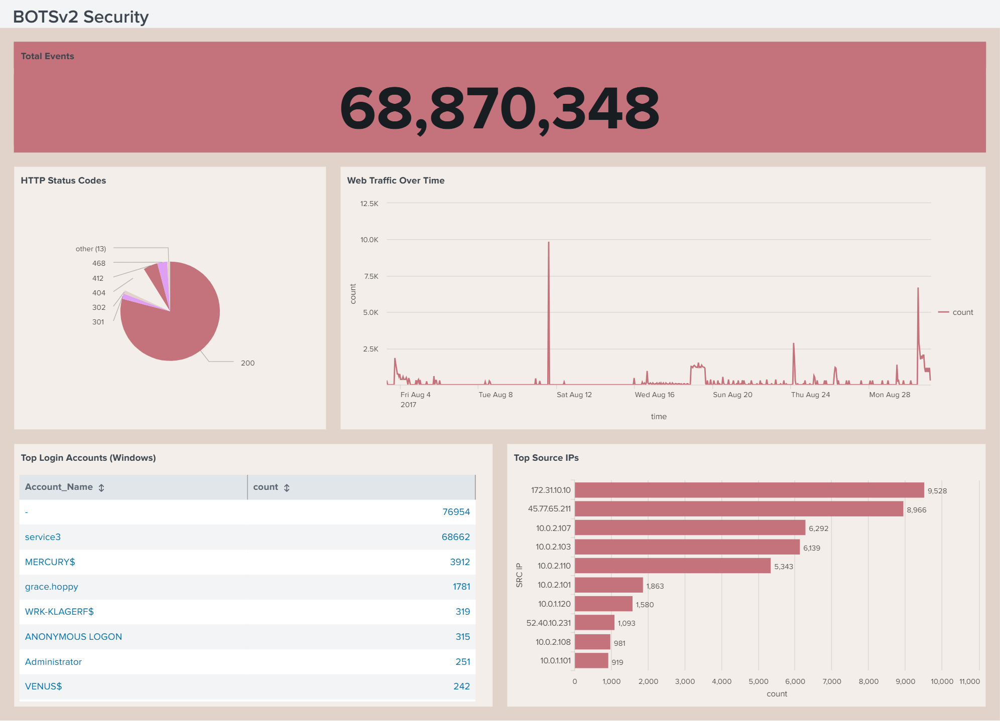

<!-- Replace bracketed placeholders with your real details before publishing. -->

# CASE-001 · SIEM Threat Detection & Dashboard Build

`Status: Documented` · `Category: Detection & Monitoring` · `Tools: Splunk Enterprise, BOTSv2 Dataset, SPL`

## Overview

This case covers standing up a working SIEM environment and learning to turn raw security logs into actionable monitoring. The lab uses **BOTSv2 (Boss of the SOC v2)** — a publicly available dataset built by Splunk for SOC training, containing logs from a simulated breach against a fictional brewing company ("Frothly"). It includes a mix of Windows event logs, network/wire data, and endpoint telemetry, which makes it realistic enough to practice real detection workflows on.

## Lab Environment

| Component | Detail |
|---|---|
| SIEM Platform | Splunk Enterprise v4.78.0 |
| Dataset | BOTSv2 |
| Indexes Used | `botsv2` |
| Key Sourcetypes | `stream:http, WinEventLog:Security` |
| Deployment | Docker container |

## Methodology

1. **Ingest & orient** — loaded the BOTSv2 dataset into Splunk and ran broad searches (`index=botsv2`) to understand what sourcetypes and fields were available before writing any targeted queries.
2. **Hunt with SPL** — wrote searches to surface indicators of compromise across the simulated environment.
3. **Build dashboards** — translated the most useful searches into permanent dashboard panels: time charts for activity volume, tables for top talkers/users, and single-value panels for at-a-glance health checks.
4. **Rehearse the demo** — practiced presenting the dashboard live, narrating what each panel shows and why it matters to someone without a security background.

## Key SPL Queries

```spl
# Detects the top 10 most active source IP addresses generating web traffic.
index=botsv2 sourcetype=stream:http
| top limit=10 src_ip

# Detects the frequency of different HTTP status codes to monitor web server responses.
index=botsv2 sourcetype=stream:http
| stats count by status

# Detects the volume of web traffic over time, grouped into 1-hour intervals.
index=botsv2 sourcetype=stream:http
| timechart count span=1h

# Detects the top 10 most frequent successful Windows login accounts.
index=botsv2 sourcetype=WinEventLog:Security EventCode=4624
| stats count by Account_Name
| sort -count
| head 10

# Detects the total number of events indexed in the dataset.
index=botsv2
| stats count
```

## Findings

- Finding 1 — Massive spikes in web traffic: Identified a major spike in web traffic reaching nearly 10,000 events around August 11, with another significant spike (over 5,000 events) occurring near the end of August. This matters because the baseline traffic is nearly zero; these sudden bursts strongly suggest automated activity, such as vulnerability scanning, brute-force attacks, or a potential denial-of-service attempt.
- Finding 2 — Suspicious volume from a specific IP: Observed that the IP address `45.77.65.211` is the second-highest source of traffic overall, generating 8,966 events. This matters because if this is an external, unrecognized IP, producing a volume of traffic comparable to the top internal IP (`172.31.10.10`) is a strong indicator of an external actor probing or attacking the environment.
- Finding 3 — Anomalous service account activity: Detected exceptionally high login event counts for the `service3` account (68,662 events), which vastly outnumbers normal user accounts like `grace.hoppy` (1,781 events). This matters because while service accounts do generate automated traffic, abnormal spikes can indicate a compromised service account being used for lateral movement or persistence.
- Finding 4 — Presence of anonymous logons: Noted 315 instances of `ANONYMOUS LOGON` in the Windows top login accounts table. This matters because anonymous logons (such as null sessions) are frequently used by attackers during the reconnaissance phase to enumerate users, shares, and network policies without needing valid credentials.
- Finding 5 — High volume of non-200 HTTP status codes: While the pie chart is dominated by successful "200" responses, there is a visible slice of client error codes, including 404s, 412s, and 468s. This matters because a high concentration of specific error codes during the identified traffic spikes could confirm directory traversal attempts, fuzzing, or other web application attacks.   

## Dashboard


*This dashboard tracks web traffic, top IP addresses, and Windows logins to help you easily spot unusual network activity or attacks.*

## Skills Demonstrated

- SPL query writing (search, stats, timechart, eval)
- Log correlation across multiple sourcetypes
- Dashboard and visualization design
- Translating technical findings for a non-technical audience

## Reflection

The most challenging aspect of this case was shifting from a development mindset to an analytical one, specifically learning to filter through massive amounts of normal system noise to confidently isolate malicious behavior in Splunk. With more time, I would drill deeper into the payload details of the web traffic spikes and script an automated workflow to cross-reference those top suspicious IPs against external threat intelligence feeds.
