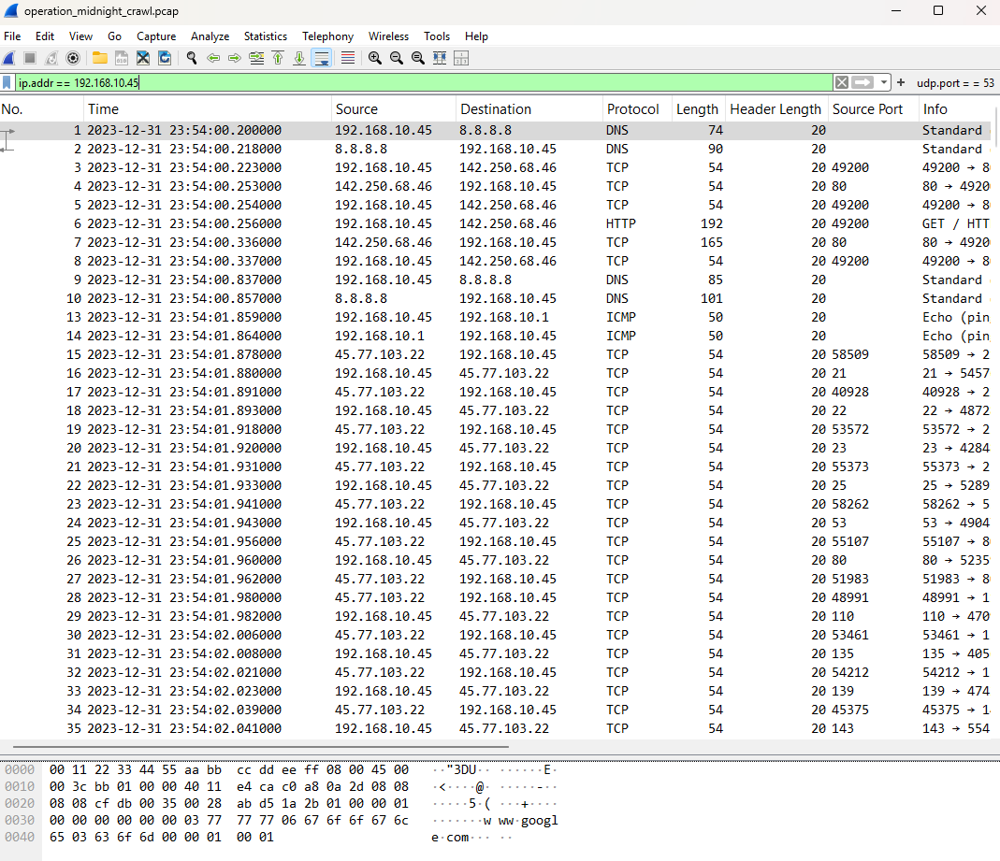
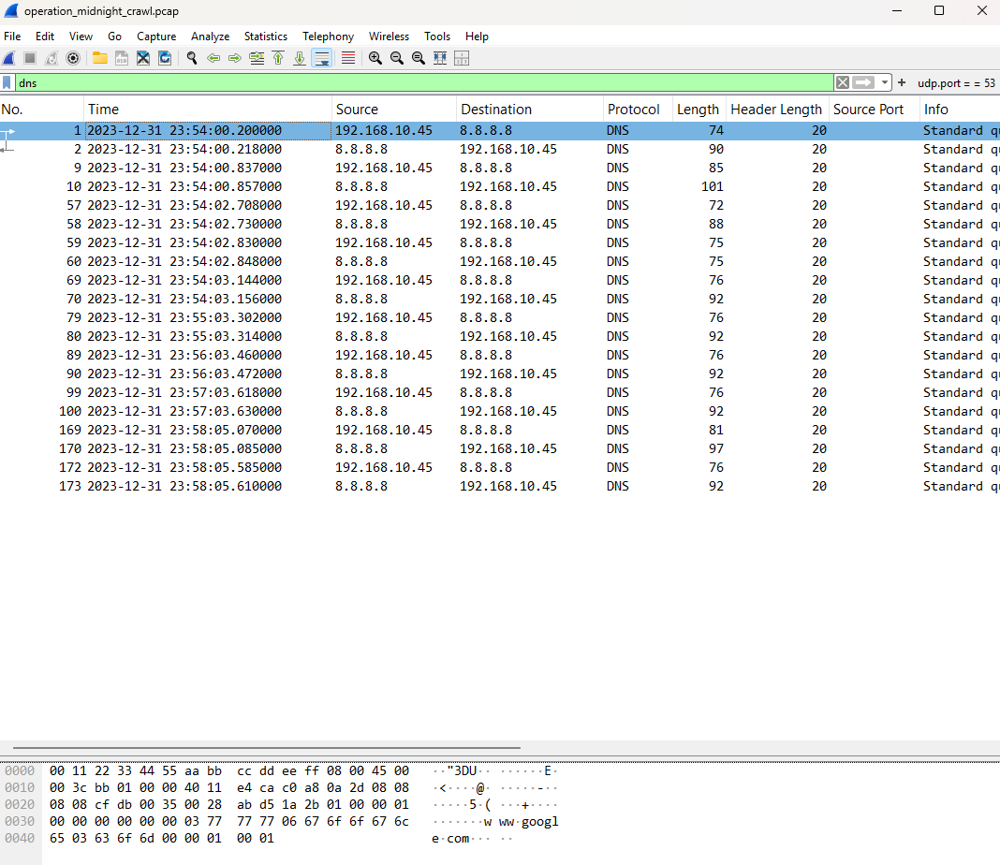
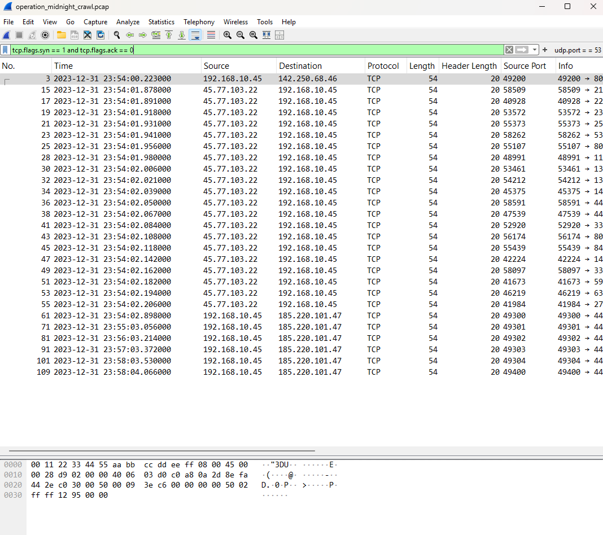
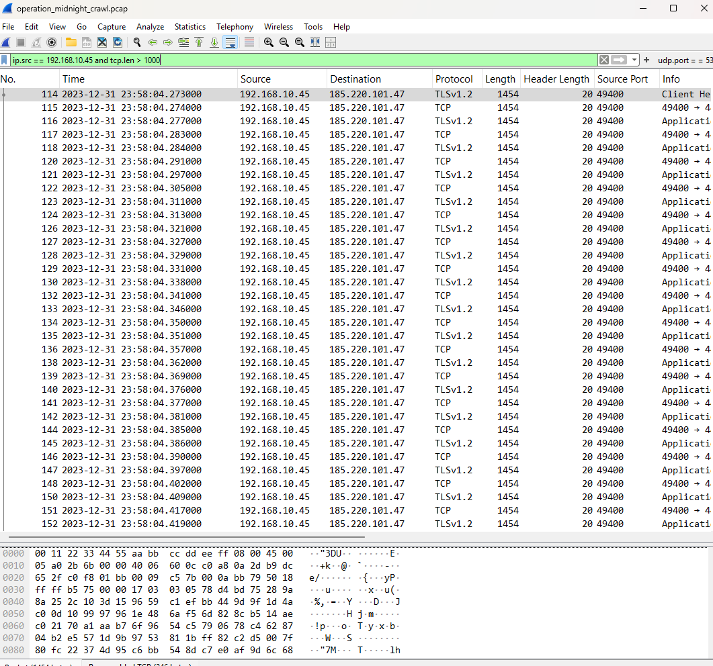
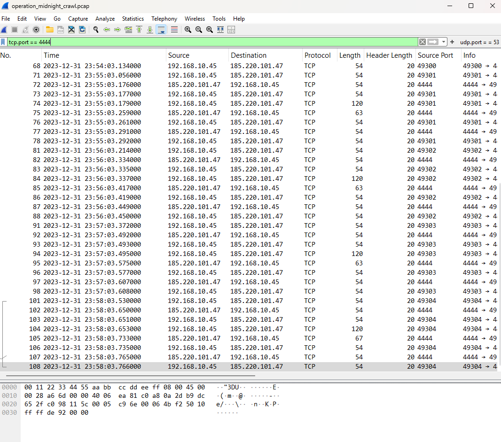

<!-- Replace bracketed placeholders with your real details before publishing. -->

# CASE-003 · Network Traffic & Packet Analysis

`Status: Documented` · `Category: Network Forensics` · `Tools: Wireshark`

## Overview

Most SOC tooling eventually points back to "go look at the packets." This case is about building that habit directly — capturing and reading raw network traffic in Wireshark instead of relying on summarized alerts.

## Lab Environment

| Component | Detail |
|---|---|
| Capture Tool | Wireshark v4.6.6 |
| Capture Source | Sample PCAP file `operation_midnight_crawl.pcap` |
| Network Context | Packet capture analysis of a simulated network compromise, isolating traffic to investigate external reconnaissance, Command and Control (C2) reverse shells, and potential data exfiltration from a victim host. |

## Methodology

1. **Orient with protocol hierarchy** — opened each capture and reviewed *Statistics → Protocol Hierarchy* before drilling into individual frames, to understand the overall traffic mix first.
2. **Filter with intent** — used display filters to isolate specific conversations and patterns rather than scrolling raw captures.
3. **Follow the stream** — reconstructed full TCP/HTTP sessions using *Follow → TCP Stream* to see what actually happened end-to-end, not just that a connection occurred.
4. **Baseline vs. anomaly** — compared a capture of "normal" traffic against a capture with suspicious activity to build a feel for what should draw attention.

## Key Filters Used
```
# Isolate all inbound and outbound traffic for the target machine
ip.addr == 192.168.10.45

# Spot potential port-scan behavior (SYN without ACK)
tcp.flags.syn == 1 and tcp.flags.ack == 0

# Isolate all Domain Name System (DNS) query and response traffic
dns

# Identify potential Command and Control (C2) activity on a common reverse shell port
tcp.port == 4444

# Isolate large outbound data packets to identify potential data exfiltration
ip.src == 192.168.10.45 and tcp.len > 1000
```

## Findings

- Finding 1 — External Port Scan: Identified a comprehensive port scan originating from the external IP 45.77.103.22 against the victim host (192.168.10.45). The attacker rapidly cycled through common ports (such as 21, 22, 23, 80, 110, 135) using initial SYN packets, indicating active reconnaissance.
- Finding 2 — Suspicious Command & Control (C2) Communication: Discovered an active connection between the victim host and external IP 185.220.101.47 communicating over TCP port 4444. Because port 4444 is the default port for Metasploit/Meterpreter reverse shells, this strongly suggests the attacker successfully established a backdoor.
- Finding 3 — Potential Data Exfiltration: Detected a steady stream of large outbound packets (over 1,000 bytes each) originating from the victim host and destined for the same malicious IP (185.220.101.47). This sustained transfer of large payloads indicates the attacker was likely exfiltrating data or downloading additional stage payloads.

## Screenshots


*This capture isolates all inbound and outbound network traffic for the target machine by using the display filter `ip.addr == 192.168.10.45`.*


*This capture isolates all Domain Name System (DNS) query and response traffic by using the display filter `dns`.*


*This capture isolates initial TCP connection requests (SYN packets) to identify potential port scanning or reconnaissance activity by using the display filter `tcp.flags.syn == 1 and tcp.flags.ack == 0`.*


*This capture isolates large outbound data packets originating from the target machine to identify potential data exfiltration by using the display filter ip.src == 192.168.10.45 and tcp.len > 1000.*


*This capture isolates network traffic over a commonly used reverse shell port to identify potential Command and Control (C2) activity by using the display filter tcp.port == 4444.*

## Skills Demonstrated

- Packet and protocol analysis
- Wireshark display filter syntax
- TCP stream reconstruction
- Traffic baselining and anomaly identification

## Reflection

What surprised me most was just how noisy a raw packet capture is compared to organized system logs, highlighting how easy it is for an attacker to hide in the overwhelming volume of normal traffic. Seeing the reverse shell communication clearly established on port 4444 was a stark, eye-opening moment that made the abstract concept of a compromise feel incredibly tangible.
