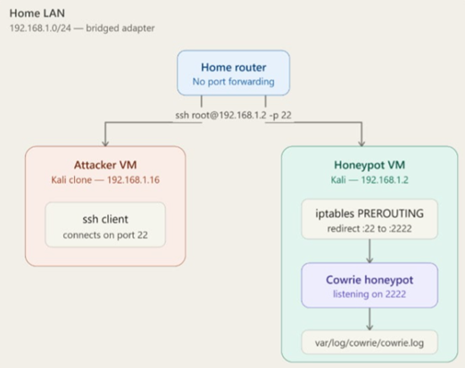

<!-- Replace bracketed placeholders with your real details before publishing. -->

# CASE-004 · Honeypot Deployment & Threat Intelligence

`Status: Documented` · `Category: Adversary Intelligence` · `Tools: Kali Linux, [Honeypot tool], Home Lab`

## Overview

A honeypot gives a firsthand, unfiltered look at what automated attackers actually do — without putting real systems at risk. This case covers deploying one inside an isolated home lab segment and analyzing what it caught.

## Lab Environment

| Component | Detail |
|---|---|
| Host OS | Kali Linux 2026.1 |
| Honeypot Software | Cowrie |
| Virtualization | VirtualBox |
| Network Isolation | Bridged Adapter |
| Exposure | Exposed only within the lab network |

## Network Diagram

*The honeypot is safely isolated from the public internet by deploying it on a local bridged network (`192.168.1.0/24`) behind a home router with no port forwarding, restricting access strictly to the local attacker VM.*

## Methodology

1. **Isolate first** — built a dedicated network segment so the honeypot could be exposed without any path back to personal devices or data.
2. **Deploy & configure** — installed and configured Cowrie on Kali Linux to passively log connection attempts, credentials tried, and any commands executed by a connecting party.
3. **Let it run** — left the honeypot live for [duration] to collect a realistic sample of automated scanning/attack traffic.
4. **Analyze the logs** — reviewed honeypot logs for patterns: common usernames/passwords attempted, source IP behavior, scanning cadence, and any follow-on actions after a simulated "successful" login.
5. **Cross-reference with packets** — correlated honeypot application-layer logs against the matching Wireshark capture (see [CASE-003](../03-wireshark-traffic-analysis)) to connect what was logged at the service level with what was visible on the wire.

## Findings

- Finding 1 — Secure local isolation: Identified that the home router is configured with "No port forwarding." This matters because it ensures the honeypot is strictly accessible only from the internal LAN (specifically the Attacker VM at 192.168.1.16), preventing accidental exposure to the public internet while safely simulating an attack environment.
- Finding 2 — Transparent port redirection: Observed that iptables PREROUTING rules are actively redirecting incoming traffic from the standard SSH port (22) to an alternate port (2222). This matters because it allows the Cowrie honeypot to run safely as a non-root user on an unprivileged port while tricking the attacker into believing they are targeting a default SSH service.
- Finding 3 — Centralized session logging: Confirmed that all attacker interactions captured by the Cowrie service listening on port 2222 are routed to a dedicated local log file (var/log/cowrie/cowrie.log). This matters because it provides a reliable, single source of truth for extracting indicators like brute-force passwords, executed commands, and dropped payloads for later analysis.

## Skills Demonstrated

- Honeypot deployment and configuration
- Network segmentation and isolation design
- Log analysis and pattern recognition
- Correlating application-layer and network-layer evidence

## Reflection

Watching live brute-force attempts hit the honeypot bridged the gap between theory and reality, highlighting how relentlessly automated real-world threats are compared to the structured software I usually build. To evolve this lab setup, I plan to integrate ASN enrichment directly into the logging pipeline so I can automatically identify the specific cloud hosting providers attackers are using to launch their scripts, turning raw IP addresses into actionable threat intelligence.
